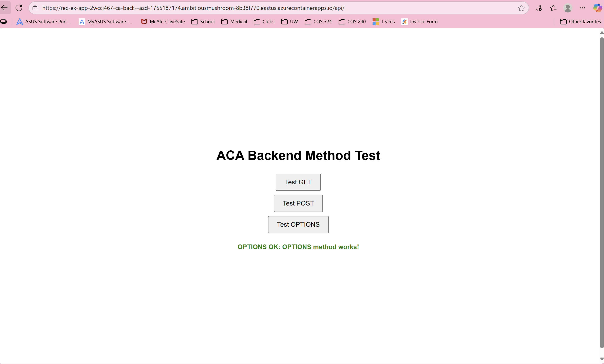

<!--
---
name: Electronic Health Record Extraction App Front End
description: This container app maintains the back end of a web app that uses Azure OpenAI to extract specific information from uploaded PDF files of health records.
languages:
- python
- javascript
- bicep
- azdeveloper
products:
- azure-openai
- azure
- azure-container-apps
page_type: sample
urlFragment: openai-chat-vision-quickstart
---
-->
# Electronic Health Record Extraction App

This repository maintains the back end of a web app that uses Azure OpenAI to extract specific information from uploaded PDF files of health records.

The project includes all the infrastructure and configuration needed to provision Azure OpenAI resources and deploy the app to [Azure Container Apps](https://learn.microsoft.com/azure/container-apps/overview) using the [Azure DevOps CI/CD](https://azure.microsoft.com/en-us/products/devops/?msockid=15120cad72a26ff73d2e1aa573606e57). The app will use managed identity to authenticate with Azure OpenAI, and it uses a GPT-4o model with the GlobalStandard SKU.

* [Features](#features)
* [Architecture diagram](#architecture-diagram)
* [Getting started](#getting-started)
  * [Azure DevOps](#azure-devops)
  * [Revision specific endpoint](#revision-specific-endpoiint)
* [Database](#database)
* [Cors connection](#cors-connection)
* [Costs](#costs)
* [Security guidelines](#security-guidelines)
* [Resources](#resources)

## Features

* A Python [Quart](https://quart.palletsprojects.com/en/latest/) that uses the [openai](https://pypi.org/project/openai/) package to generate responses to user messages with uploaded image files.
* A cors connection to respond to calls from the front end app.
* [Bicep files](https://docs.microsoft.com/azure/azure-resource-manager/bicep/) for provisioning Azure resources, including Azure OpenAI, Azure Container Apps, Azure Container Registry, Azure Log Analytics, and RBAC roles.
* Azure OpenAI GPT-4o vision and chat model, 2wccj467aelpw-cog, for analysis of images.
* CI/CD with Azure DevOps using RecordExtractionBackend pipeline in RecordExtractionApp project.

## Architecture diagram

The resources used by this app are all under the rec-ex-app-rg resource group in the [billing@xenonhealth.com](billing@xenonhealth.com) account. They are as follows:
* Azure Container Registry: recexapp2wccj467aelpwregistry
* Azure Container App Environment: rec-ex-app-2wccj467aelpw-containerapps-env
* Azure Log Analytics Workspace: rec-ex-app-2wccj467aelpw-loganalytics
* Azure Managed Identity: rec-ex-app-2wccj467aelpw-id-aca

## Getting started

### Azure DevOps

You can continuosly develop and deploy this app using Azure DevOps. This project is called `RecordExtractionApp` and the main owner of the project is [billing@xenonhealth.com](billing@xenonhealth.com). Once your account is added as a Contributor to the project, you will be able to develop the codebase.
1. Relevant Azure CLI Login keys are found in the **RecordExtractionApp_CLILogin_Vars** variable group in the project's Library, found under Pipelines.
2. The main CI/CD pipeline for this app is titled `RecordExtractionBackend`. It should take ~4 minutes to integrate any committed changes.
3. The endpoint URL for this app is [https://rec-ex-app-2wccj467-ca-back.ambitiousmushroom-8b38f770.eastus.azurecontainerapps.io](https://rec-ex-app-2wccj467-ca-back.ambitiousmushroom-8b38f770.eastus.azurecontainerapps.io). You can navigate to the simple, test front end for this app at [https://rec-ex-app-2wccj467-ca-back.ambitiousmushroom-8b38f770.eastus.azurecontainerapps.io/api](https://rec-ex-app-2wccj467-ca-back.ambitiousmushroom-8b38f770.eastus.azurecontainerapps.io/api) to test it.

### Revision specific endpoint

The Azure container app containing the EHR Extraction App is titled `rec-ex-app-2wccj467-ca-back` and is owned by the [billing@xenonhealth.com](billing@xenonhealth.com) Azure account.
1. Access the revision specific endpoint URL for the app by navigating to `rec-ex-app-2wccj467-ca-back` in the [Azure Portal](https://portal.azure.com/signin/index/), navigate to the **Application** dropdown on the left bar, select **Revisions and replicas**, click on the **Active Revisions** and select the app that is *Running* to copy its *Revision URL*.
2. Copy-paste the *Revision URL*.

## Database

The results of the EHR Extraction App can be saved, if desired by the user, to a database. The database is hosted by [Azure CosmosDB for PostgreSQL Cluster](https://learn.microsoft.com/en-us/azure/cosmos-db/postgresql/). The cluster is named `rec-ex-app-db-cluster` and is owned by [billing@xenonhealth.com](billing@xenonhealth.com). 
1. The authentication information to open a connection with the `rec-ex-app-db-cluster` can be found in the **PostgreConnectionVars** variable group in the project's Library, found under Pipelines. This information uses the admin username role, **citus**, to open the connection to provide maximal development abilities. It includes the information *db-host*, *db-name*, *db-user*, *db-password*, and *db-port*. 
2. The database can be examined by using [Azure Data Studio](https://learn.microsoft.com/en-us/azure-data-studio/download-azure-data-studio). Once Azure Data Studio is downloaded to one's local computer, they can create a connection with `rec-ex-app-db-cluster` using the following information:
- Connection type: PostgreSQL
- Server name: db-host
- Authentication type: Password
- Username: citus@rec-ex-app-db-cluster
- Password: db-password
- Database name: default
- Advanced tab:
    - SSL Mode: Require
    - Port: 5432
3. The data is stored in 2 tables. `result_objects` stores the metadata for each saved result, including the table of extracted information, the timestamp that the result was saved, the **file_id** of all associated analyzed PDF files, the processing mode to conduct the analysis, the title of the result, and the **result_id**. `result_files` stores the PDF files as BYTEA objects. Each **result_file** is mapped to its associated **result_object** through the corresponding **file_id** and **result_id** links. These tables can be found under the `citus` database under the `public` Schema.

## Cors connection

The cors connection is established in the src/quartapp/__init__.py file and it enables all origins, all methods, and all headers. This should enable flexible communication with the intended front end for the EHR Extraction App and any other front end apps created by Xenon Health.

## Guidance

### Costs

1. The Azure Container App is currently hosted with 2 vCPU cores and 4 GiB of memory storage. The cost of this app is dependent on how often and how heavily it is used. The cost is carried by the *538ea07f-d924-486e-b6f3-5ca66a533d78* subscription under the [billing@xenonhealth.com](billing@xenonhealth.com) account.
2. The PostgreSQL database is currently hosted with on a Single Node. The Node Compute has 2 Burstable vCores and 4 GiB of RAM, the Node Storage has 64 GiB of memory. High availability has been disabled. This configuration costs 63.13 USD per month and the charge is carried by the [billing@xenonhealth.com](billing@xenonhealth.com) account.
3. The OpenAI gpt-4o model is dependent on how often and how heavily the app is used. The cost is carried by the *538ea07f-d924-486e-b6f3-5ca66a533d78* subscription under the [billing@xenonhealth.com](billing@xenonhealth.com) account.
4. The associated Azure Container Registry is under the `rec-ex-app-rg` resource group carried by the *538ea07f-d924-486e-b6f3-5ca66a533d78* subscription under the [billing@xenonhealth.com](billing@xenonhealth.com) account.

You can try the [Azure pricing calculator](https://azure.com/e/3987c81282c84410b491d28094030c9a) for the resources:

* Azure OpenAI Service: S0 tier, GPT-4o model. Pricing is based on token count. [Pricing](https://azure.microsoft.com/pricing/details/cognitive-services/openai-service/)
* Azure Container App: Consumption tier with 0.5 CPU, 1GiB memory/storage. Pricing is based on resource allocation, and each month allows for a certain amount of free usage. [Pricing](https://azure.microsoft.com/pricing/details/container-apps/)
* Azure Container Registry: Basic tier. [Pricing](https://azure.microsoft.com/pricing/details/container-registry/)
* Log analytics: Pay-as-you-go tier. Costs based on data ingested. [Pricing](https://azure.microsoft.com/pricing/details/monitor/)

⚠️ To avoid unnecessary costs, remember to take down the app if it's no longer in use,
either by deleting the resource group in the Portal or running `azd down`.

### Security guidelines

This template uses [Managed Identity](https://learn.microsoft.com/entra/identity/managed-identities-azure-resources/overview) for authenticating to the Azure OpenAI service.

You may want to consider additional security measures, such as:

* Protecting the Azure Container Apps instance with a [firewall](https://learn.microsoft.com/azure/container-apps/waf-app-gateway) and/or [Virtual Network](https://learn.microsoft.com/azure/container-apps/networking?tabs=workload-profiles-env%2Cazure-cli).

### Resources

About this app:
* [User Manual](https://docs.google.com/document/d/17vpTEgW7pZxo4fvFnLWOS700H28p9FfkcPLRyhukga0/edit?usp=sharing): Yubi Mamiya's user manual of the EHR Extraction App.
* [Project Workflow](https://docs.google.com/presentation/d/19f-rZHBwsyk8X2XxWWtSCqYNQyF4mWQxXxgLeIR0-X4/edit?usp=sharing): Yubi Mamiya's detailed report of the technical progress of the EHR Extraction App.
* [Final Presentation](https://docs.google.com/presentation/d/1DdVqYQX41UTfBu8wFK52KoqnCogkOGU-sNT-AFmFXcE/edit?usp=sharing): Yubi Mamiya's overview of the EHR Extraction App.

 Related documents:
* [Develop Python apps that use Azure AI services](https://learn.microsoft.com/azure/developer/python/azure-ai-for-python-developers)
* [OpenAI Chat Vision Quickstart](https://github.com/Azure-Samples/openai-chat-vision-quickstart): Base repository for this app.
* [Quart](https://quart.palletsprojects.com/en/latest/)